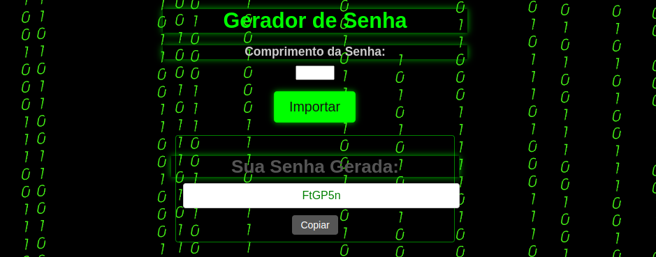

# PI - ADS - Password Generator

This project is a university assignment for the course "Analysis and Software Development (ADS)" where we have developed a password generator web application using PHP, JavaScript, HTML, and CSS. The application generates secure and random passwords based on user-specified criteria.

## Features

- Generates secure passwords based on user-selected password length.
- Allows users to specify the desired length of the password.
- Generates random passwords with the specified length.
- Provides a user-friendly interface for generating passwords.
- Validates user input to ensure a valid password length is entered.
- Utilizes client-side JavaScript for dynamic password generation.

## Technologies Used

- PHP
- JavaScript
- HTML
- CSS

-------------------------------------------------------------------------------------------------------------------------------------------------------------------------------------------------------

# PI - ADS - Gerador de Senhas

Este projeto é uma tarefa universitária para o curso "Análise e Desenvolvimento de Software (ADS)", onde desenvolvemos uma aplicação web geradora de senhas utilizando PHP, JavaScript, HTML e CSS. A aplicação gera senhas seguras e aleatórias com base nos critérios especificados pelo usuário.

## Recursos

- Gera senhas seguras com base nos critérios selecionados pelo usuário.
- Permite aos usuários especificarem o comprimento da senha.
- Gera senhas randômicas com o comprimento.
- Fornece uma interface de fácil utilização ao usuário.
- Valida a entrada do usuário para garantir uma seleção de comprimento adequado.
- Utiliza JavaScript do lado do cliente para geração dinâmica de senhas.

## Tecnologias Utilizadas
- PHP
- JavaScript
- HTML
- CSS
